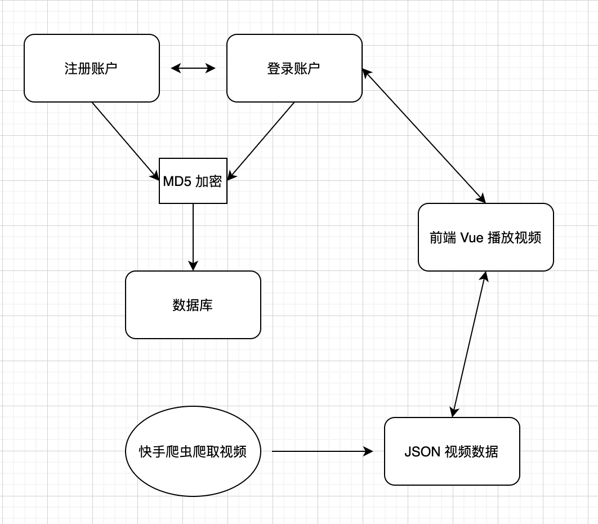

# 快手视频播放器

## 项目流程

### 爬虫可以获取以下内容并存储为 JSON

- 作者头像
- 视频链接
- 点赞数量
- 作者ID
- 视频名称

### 登陆注册包含前端 MD5 加密

- md5.js
- 避免明文传输密码
- 服务器不存储密码，仅存储 md5 编码
- 可以加 salt

### 播放器模仿抖音界面

- 使用 Vue.js 开发
- 动画使用 Swiper.js